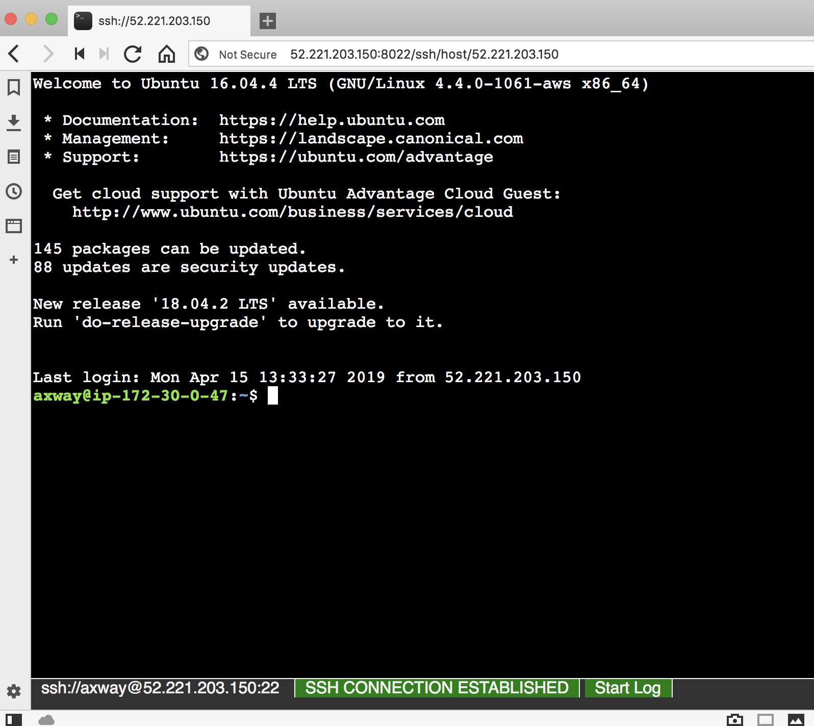

# Well Crafted API Models – Key to Streamlining Workflows: Lab

Hands-On Lab for the Axway Technical Workshop 'Well Crafted API Models – Key to Streamlining Workflows' at API Days 2019

## Introduction

In this lab participants will use Axway's API Builder to:

* create a data model for an API
* create a CRUDL interface (Create, Read, Update, Delete, List)
* package the endpoint in a Docker container
* consume the API using Swagger Editor

API Builder is a development tool that usually runs on a developer's machine directly, such as Windows laptop, a MacBook or a Linux desktop. For this lab we're using a server side setup so participants can perform all steps with just a browser connection. This is useful for environments with network restrictions, or where for any reason participant can't install the necessary requirements such as NodeJS on their machines.

## Step 1: Get Access to an Instance

Use [this form](https://forms.gle/ZG9qohvq3TDf5wccA) to provide your email address in order to get access:

The instructor will send you the details on how to access your lab instance. Click on the link provided or copy/paste the link in your prefered web browser. You should now have terminal access.

