# Well Crafted API Models – Key to Streamlining Workflows: Lab

Hands-On Lab for the Axway Technical Workshop 'Well Crafted API Models – Key to Streamlining Workflows' at API Days 2019

## Introduction

In this lab participants will use Axway's API Builder to:

* Create a data model for an API
* Create a CRUDL interface (Create, Read, Update, Delete, List)
* Package the endpoint in a Docker container
* Deploy the Image
* Consume the API using Swagger Editor

This covers the first steps in an API Lifecycle where participants are looking at **Design** -> **Build** -> **Deploy** of an API endpoint from a hands-on perspective. A plausible next step would be adding access control, governance & service catalog with an API Management solution including an API Portal.

### Technical Environment

API Builder is a development tool that usually runs on a developer's machine directly, such as Windows laptop, a MacBook or a Linux desktop. For this lab we're using a server side setup so participants can perform all steps with just a browser connection. This is useful for environments with network restrictions, or where for any reason participant can't install the necessary requirements such as NodeJS on their machines. If you're keen to do this lab outside of a training session, [simply install API Builder on your local machine](https://github.com/u1i/apibuilder).

## Step 1: Get Access to an Instance

Use [this form](https://forms.gle/ZG9qohvq3TDf5wccA) to provide your email address in order to get access:

The instructor will send you the details on how to access your lab instance. Click on the link provided or copy/paste the link in your prefered web browser. You should now have terminal access.

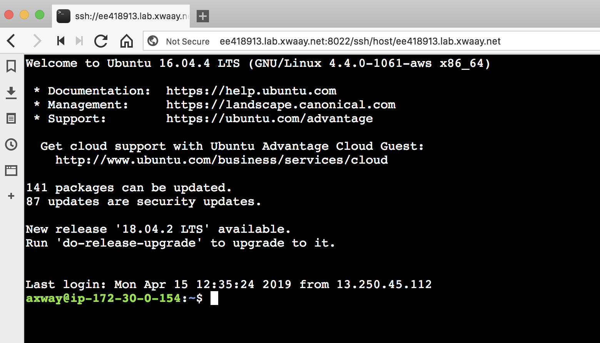

## Step 2: Start API Builder

In the web based terminal, type the following commands:

`cd myproject`   
`npm start`

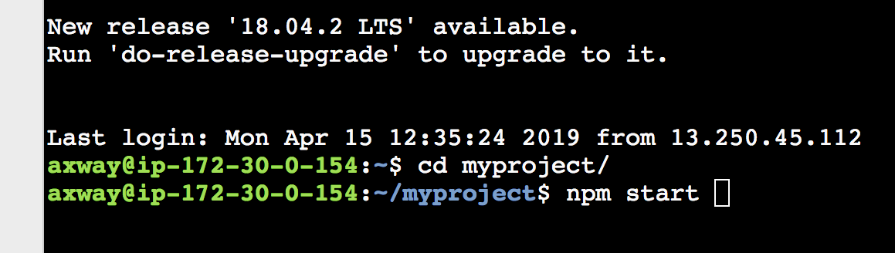

You should see the following output:

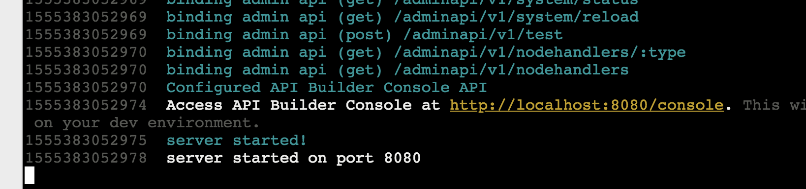

API Builder is running on your personal lab instance. Now open a new browser tab. Copy the IP address or hostname of your lab instance and browse to <host>:8080/console

**Example**: your assigned host is ee418913.lab.xwaay.net so API Builder should now be available at http://ee418913.lab.xwaay.net:8080/console

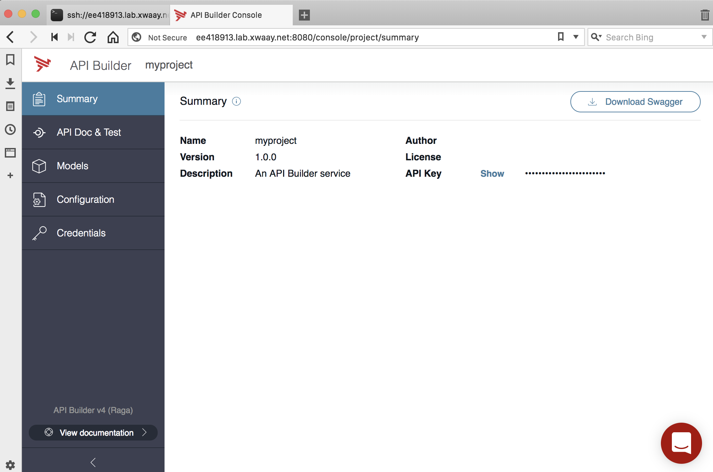

## Step 3: Create a Data Model & API

API Builder offers an easy way for creating a data model and the corresponding CRUDL endpoints – without coding! In this exercise you will create the `customer` data model which has two fields: `name` and `email`. 

Click on the 'Models' tab on the left followed by the blue '+ Model' button on the top right.

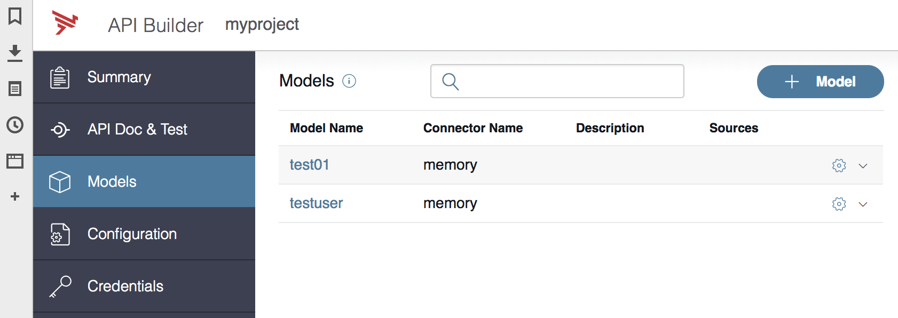

Choose the name `customer` for the new data model and click 'Next'. API Builder has several connectors (such as Oracle, MySQL, MongoDB), in this case we're using the in memory connector as the default.

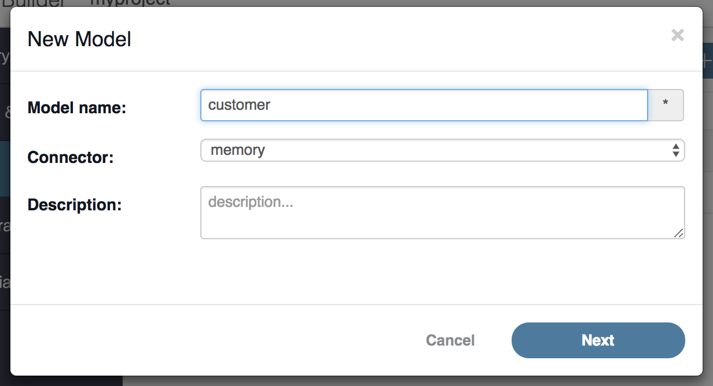

In the following dialog use the '+Field' button to add the two required fields `name` and `email ` to the data model.

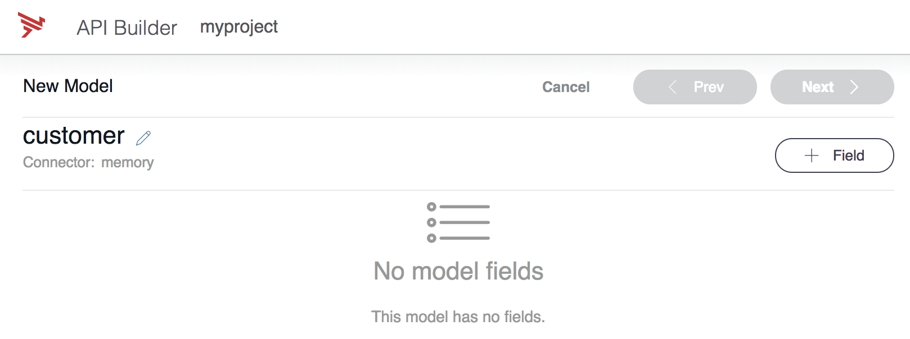

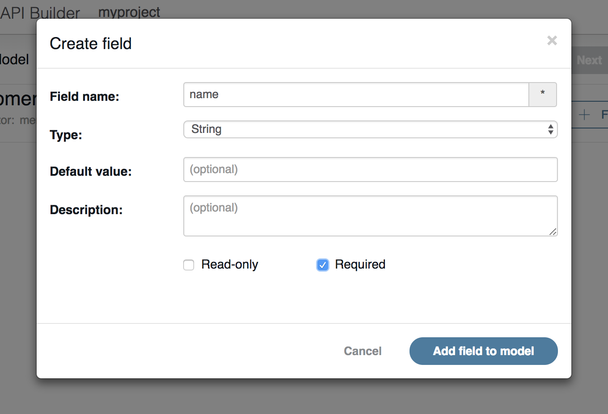

Your result should look like this:

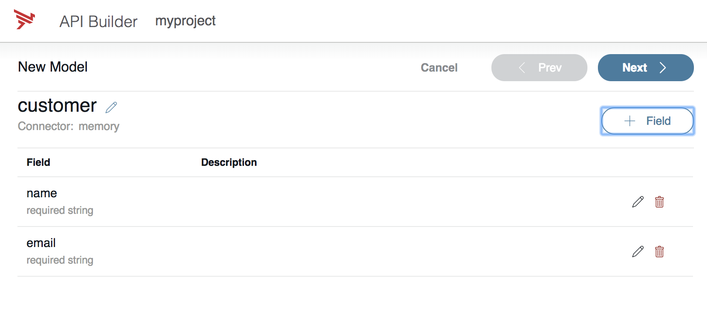

Now when clicking 'Next', API Builder creates the CRUD (Create, Read, Update) API endpoints for you. Once you click 'Save' the process is complete.

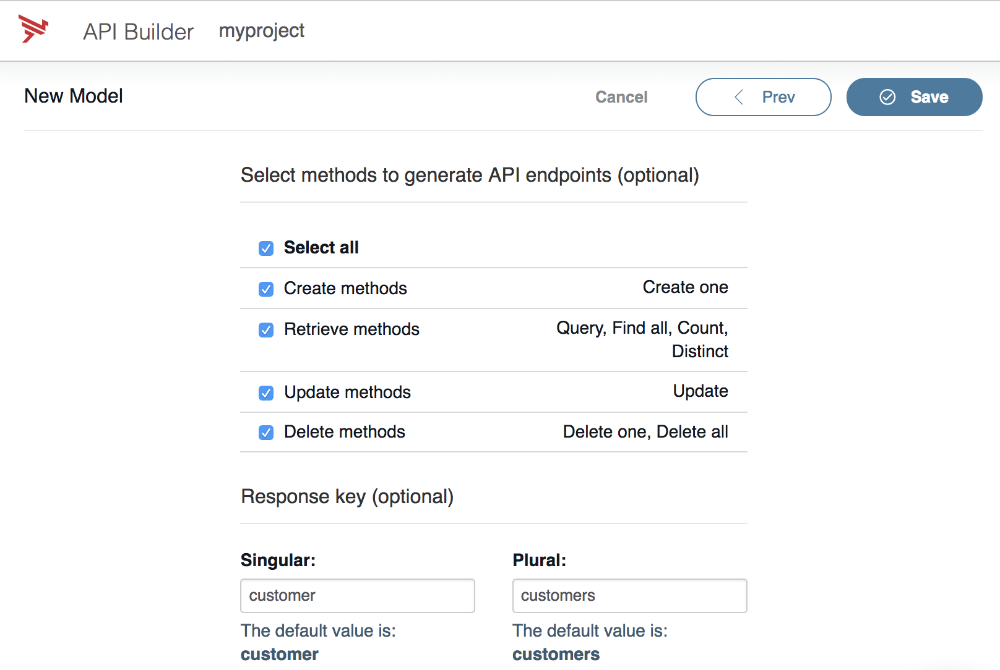

## Step 4: Review & Test the API

With just a few clicks you created a `customer` data model and API endpoints. Click on the 'API Doc & Test' section on the left to review the generated Swagger document and test the API endpoints in the browser.

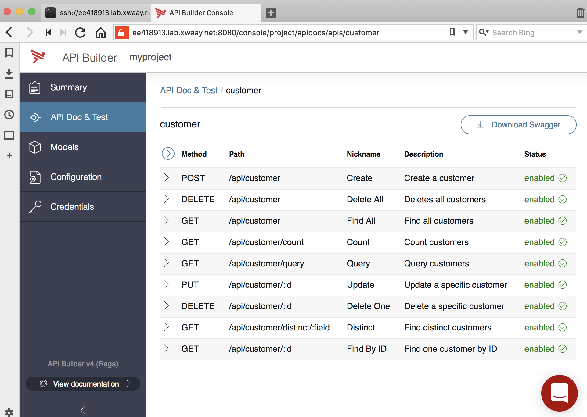

Click on the 'Post' request to create a couple of customer entries in the in-memory database, add some meaningful info into the 'name' and 'email' fields and click 'Create'.

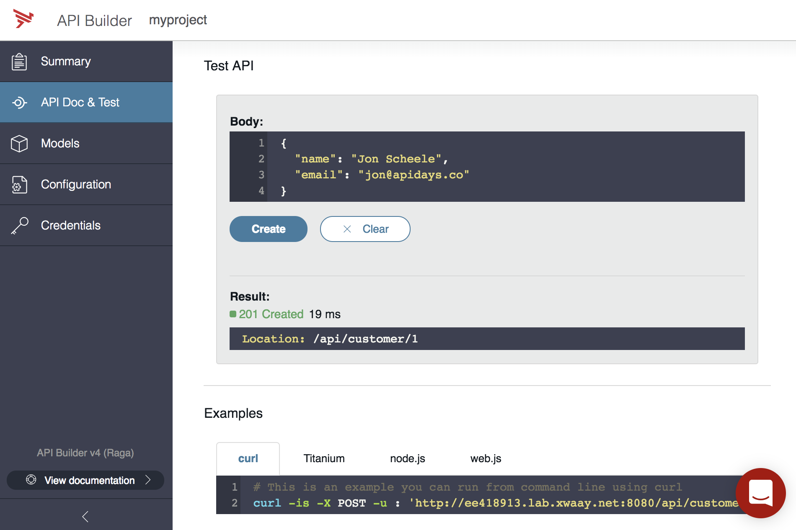

You can then use some of the other endpoints to query, update or delete the customer data. Alternatively, you might just open another terminal window (either in the browswer or on your local machine) to use Postman or cURL to perform these actions.

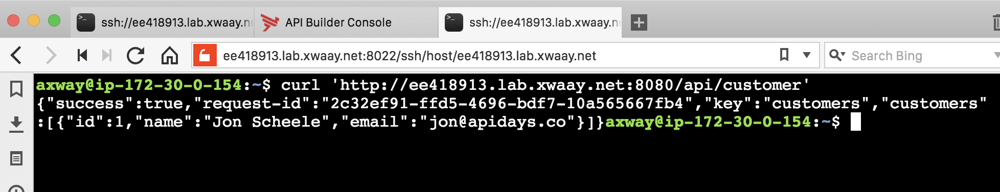

API Builder automatically creates an Open API specification ("Swagger file") for your API. Right-click on the 'Download Swagger' button in the API definition and open the document in a new tab and copy/paste the URL for the next step.

## Step 5: Open API Documentation in Swagger Editor

Open [Swagger Editor](http://editor.swagger.io) in a new browser tab – the tool that helps you build, review & validate Swagger documents. By default, it opens the famous 'Petstore' API.

Click on 'File' and copy the URL from the previous step into the 'Import URL' dialog. Alternatively, if you have downloaded the Swagger file previously you could upload it here.

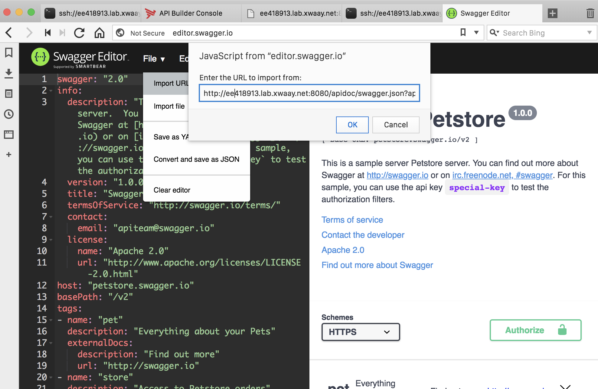

Swagger Editor now renders the documentation along with a sandbox on the right side, while displaying the 'source' on the left:

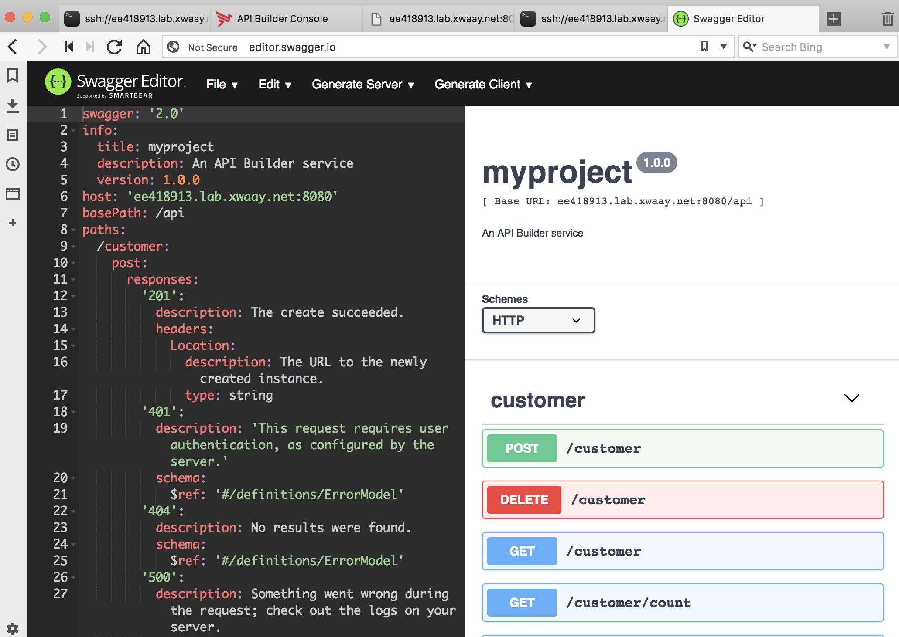

You can experiment with the endpoints using the sandbox interface. Click on 'Generate Client' to have Swagger Hub create an SDK in your prefered programming language. Do you realize – a well formed Open API specification is the basis for everything!

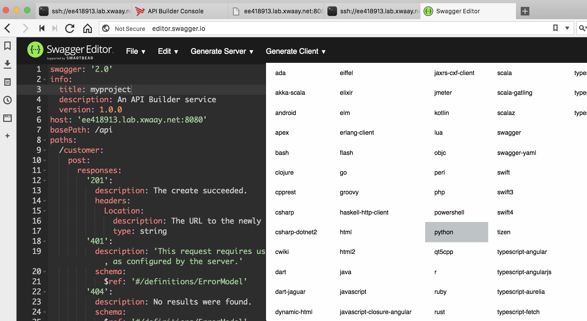

## Step 6: Build & Deploy Docker Image

If you've looked around a bit in the Linux environment of your lab environment you might have noticed that there's a Dockerfile! You can use it 

If API Builder is still running, press Ctrl+C to stop it. The following command 'bakes' a self-contained docker image with your data model, the API endpoints and all necessary libraries in it:

`docker build . -t customer:1`

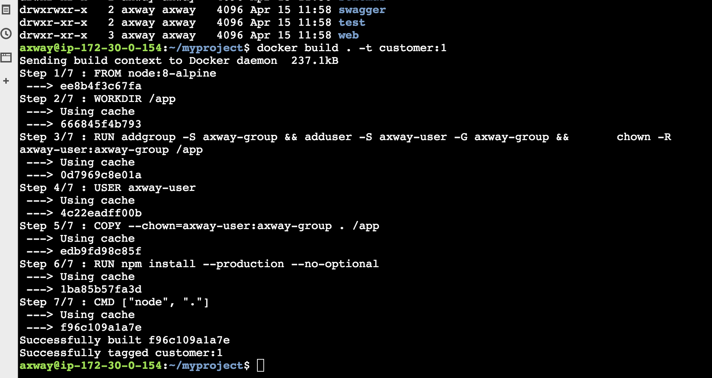

If you have an account on [DockerHub](https://hub.docker.com/) you can upload the new image there:

`docker login` (use your credentials)   
`docker tag customer:1 <id>/customer:1` (replace with your ID)   
`docker push <id>/customer:1`

From there you can run your new API on any environment that gives you Docker, such as OpenShift, Kubernetes. Since your lab environment has Docker installed you can simply run it there:

`docker run -d -p 8080:8080 customer:1`

The endpoints & Swagger will now be available on port 8080. Do note that the GUI is deactivated for security reasons.

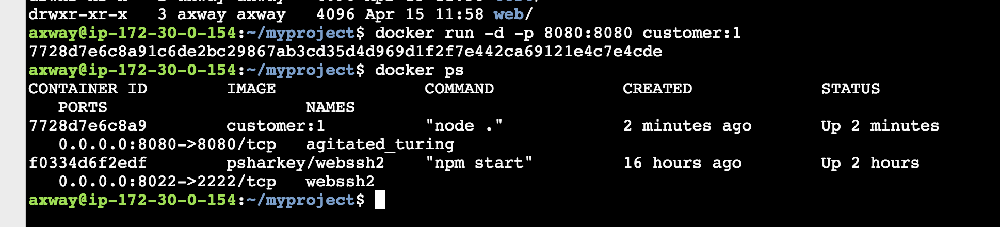

## Wrap-Up

In this lab you've used API Builder to create a data model and CRUD endpoints for a customer database. You'll have seen automatically generated documentation, sandbox, SDKs and the interoperability with tools such as cURL, Swagger Editor and Postman – all a result of well crafted API models based on open standards!